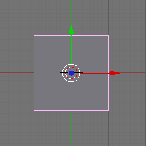
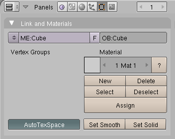
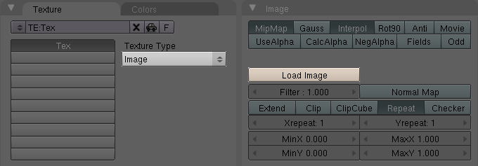
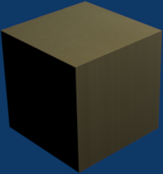
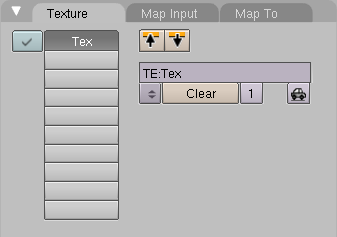

## 1.图片纹理图（Image Texture Map） ##

这个教程介绍了如何给一个对象应用纹理图。

### 开始 ###

打开Blender后，屏幕看起来如下：

 
在屏幕中心是一个3D立方体。

1. 按下F12来渲染场景
2. 按下ESC，当完成后

### 编辑按钮 ###

在屏幕下面是一排按钮，看起来如下：

 
这个选项卡用于编辑立方体的实体结构。我们想做的是改变它的底纹（shading）。

### 底纹 ###

按下F5键或点击按钮 ：

默认的立方体已经关联了一个材质，名字就是Material：

 
纹理按钮

按下F6键或点击按键 ：

1. 改变Texture Type从None到Image
2. 点击Load Image

	
 
选择你自己的文件，我加载了下面的黄铜（brass）图片：

预览改变如下：

 
按下F12来渲染：

 
黄铜色看起有污点（smear），因为输入的纹理贴图是一个平面，修改：

1. 按下ESC来关闭渲染
2. 按下F5键打开材质按钮。你会看打以下面板：

	

3. 点击Map Input选项卡：

	

4. 点击Cube按钮
5. 按下F12来渲染

	
