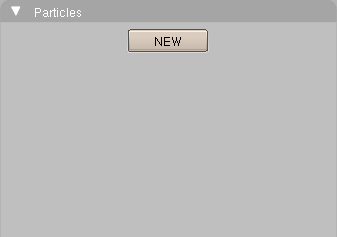
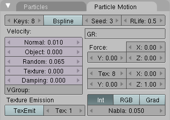

## 10.太阳的日冕（Sun's Corona） ##

如何使用粒子来制作日冕。先看下“图片纹理图”再继续。

### 添加球体 ###

添加一个常规的UVsphere作为太阳。

1. 按下NUM1来改变视角
2. 按下NUM5改变视角
3. 按下DEL来删除3d立方体
4. 按下Enter来确认
5. 按下Space打开目录
6. Add>Mesh>UVsphere
7. 点击OK确定32 Segments
8. 点击OK确定32 Rings

**添加粒子球体作为一个IcoSphere**

1. 按下Tab退出编辑模式
2. 按下a来取消选定第一个球体
3. 按下z切换到线框模式
4. 按下Space打开目录
5. Add>Mesh>IcoSphere
6. 点击OK确认2 Subdivisions
7. 按下Tab退出编辑模式
8. 按下n来显示Transform Properties面板

	

9. 改变ScaleX, ScaleY, 和ScaleZ从1.000到0.400
10. 按下Enter来确定这个新的比例

### 粒子 ###

1. 按下F7或点击对象图标来显示对象按钮
2. 点击物理图标来显示物理按钮
3. 点击New

	
 
4. 点击Static
5. 在空白处填充不同的Children（Generation、Num和Prob改变）

	

	

6. 点击Particle Motion
7. 在空白处填充：

	
 
变量的值如下：

	Variable Value

	Seed 3
	
	RLife 0.5

	Normal 0.010
	
	Random 0.065

这时你能看到粒子从IcoSphere中发出。

 
按下F12渲染

### 日冕光环发光 ###

为了创建光环，我们改变粒子为光环。

1. 按下F5或点击shading图标来显示材质按钮。
2. 在Links and Pipeline面板处点击Add New

	
 
	一些面板应该出现，包括：

	

3.设置颜色和alpha如下：

	R 1.000

	G 0.313
	
	B 0.000

	A 0.020

4. 点击Halo
5. 点击ZTransp来使alpha透明，这使日冕变淡，你应该看到：

	
 
6. 按下F12渲染：

	
 