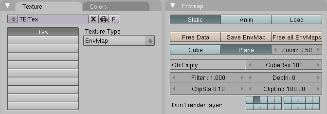

## 11.光环反射（Halo Reflection） ##

如何创建一个光环反射粒子

### 设置 ###

1. 找到“太阳的日冕”例子里最后做好的模型
2. 开启Blender
3. 按下F1或点击File>Open...
4. 选择之前的模型

### 一个平面和一个Empty ###

1. 按下a来取消选定日冕光环粒子
	
	

2. 按下NUM7来改变视角为顶视图
3. 按下Space打开目录
4. Add>Mesh>Plane
5. 按下s，然后x，之后20，改变平面沿x轴的比例
6. 按下s，然后y，之后20
7. 按下NUM1
8. 按下Tab进入对象模式
9. 在光环粒子上点击RMB
10. 按下g，然后z，之后1.5，最后Enter移动光环粒子到z轴上
11. 在球体上点击RMB
12. 按下g，然后z，之后1.5，最后Enter来移动球体到z轴上
13. 按下F12来渲染

	

14. 按下ESC
15. 按下a来取消选择球体
16. 按下Space
17. Add>Empty

	是的，目录选项真的是叫“Empty”

18. 按下r，然后x，之后-90，最后Enter来旋转z轴朝向摄像机
19. 按下g，然后x，之后7.481，最后Enter
20. 按下g，然后y，之后-6.508，最后Enter
21. 按下g，然后z，之后-5.344，最后Enter

	Empty必须在摄像机的下面。如果你的摄像机不是在(7.481, -6.508, 5.344)，那么Empty的位置就要根据摄像机的位置改变。注意z轴为负。

### 平面的环境贴图 ###

1. 按下NUM7
2. 按下NUM- 五次，直到平面的边变得可见
3. 在平面边处点击RMB来选择
4. 按下F5
5. 点击Add New
6. 改变Spec和Ref为0.200

	

7. 在Texture面板处，点击Add New
8. 点击Map Input选项卡
9. 点击Refl
10. 点击Map To选项卡
11. 点击Cmir
12. 点击F6
13. 改变Texture Type为EnvMap
14. 改变Depth为5
15. 点击Plane
16. 点击第二个Don't render layer按钮
17. 改变CubeRes为1000
18. 改变Ob：为Empty

	
 
	CubeRes区域控制发射出现的细节。

19. 点击Free Data
20. 点击Free all EnvMaps

### 移动平面 ###

由于环境贴图是从Empty的位置来计算的，平面必须移动到另一层，以免它阻塞啦Empty的视角

1. 按下m，然后2，之后Enter来移动平面到Layer 2
2. 按下SHFT-2来表示两个layers都要被渲染
3. 按下F12

 	