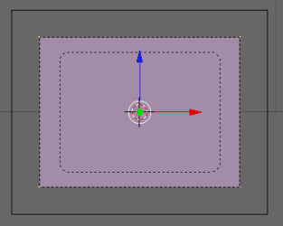
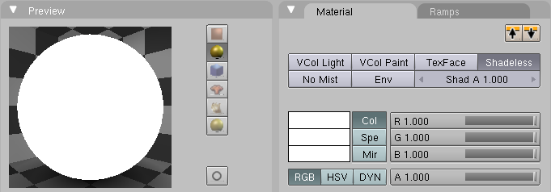
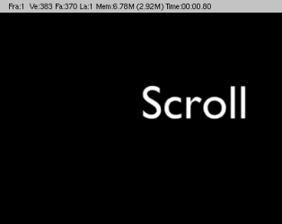

## 13.动画：卷动标题（Scrolling Title Credits） ##

这个教程展示了如何卷动标题

### 设置摄像机 ###

1. 按下CTRL-x，然后Enter进入一个新的场景
2. 按下Del，然后Enter删除3D立方体
3. 在camera上点击RMB
4. 按下Del，然后Enter删除默认摄像机
5. 按下NUM1到前视图
6. 按下SPACE开启目录
7. Add>Camera
8. 按下NUM7到顶视图
9. 按下g，y，-5，然后Enter来使摄像机向后移动一点
10. 按下NUM0到摄像机视角
11. 按下F9来开启编辑按钮
12. 点击Orthographic
13. 点击Passepartout
14. 改变Alpha从0.200到0.100

### 黑色背景 ###

1. 按下SPACE开启目录
2. Add>Mesh>Plane
3. 按下s，x，3，然后Enter来改变平面在x轴上的比例
4. 按下s，z，2.25，然后Enter来改变平面在z轴上的比例

		

5. 按下Tab来离开编辑模式
6. 按下g，y，.1来使平面稍微移动一下
7. 按下F5
8. 选择已有的材质（或点击ADD NEW）
9. 点击Env（在Material选项下）使平面不可见
10. 按下F5三次多（或点击world图标）
11. 改变默认的深蓝色到黑色

	
 
### 文字 ###

1. 按下SPACE开启目录
2. Add>Text
3. 按下BACKSPACE来抹去文字
4. 输入Scroll
5. 按下Tab到对象模式
6. 按下z到线框模式
7. 按下F5开启材质按钮
8. 点击Add New为文字添加一个新的材质
9. 点击Shadeless
10. 改变颜色为白色

	
 
11. 按下F12

	
 
### 卷动 ###

将平面作为文字的父对象，移动平面穿过摄像机的视角，然后文字成卷形的。

1. 在文字Scroll上点击RMB
2. 在屏幕上按SHIFT-RMB
3. 按下CTRL-p使平面成为文字的父对象
4. 在平面上按下RMB
5. 保证Frame 1被选定
6. 按下i出现一个菜单项来插入Ipo
7. 选择Loc
8. 改变当前帧从1到50
9. 按下g、z、5，然后Enter来移动平面原理摄像机视角
10. 按下i，然后Enter来存储这个新的Location
11. 移动鼠标到Ipo窗口
12. 按下a来选择所有点

	

13. Curve>Interpolation Mode>Linear
14. Render>Render Animation

当你播放动画，文字在屏幕中卷起。
