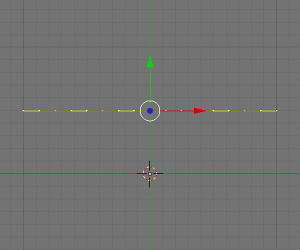
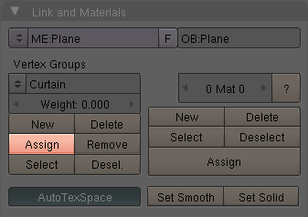
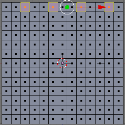
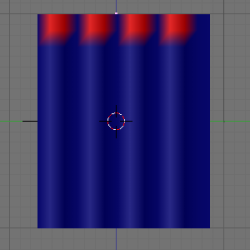
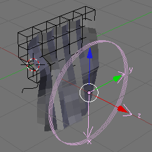
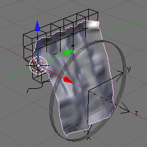

## 14.软体窗帘（Softbody Curtains） ##

这个教程展示了如何创建窗帘。它使用这些特征：

- NURB Curves 
- 柔体 
- 动画 
- 加权的顶点 
- 点阵 
- IPOs 
- Empties和Wind

### 窗帘 ###

1. 按下CTRL-x，然后Enter打开一个新的场景
2. 按下Del，然后Enter来删除3D立方体
3. 按下NUM1切换到前视图
4. 按下SPACE打开目录
5. Add>Mesh>Plane
6. 按下w打开目录
7. 点击Subdivide Multi
8. 改变2到12
9. 点击OK
10. 按下Tab切换到对象模式
11. 按下NUM7到顶视图
12. 按下SPACE打开目录
13. Add>Curve>NURBS Curve
14. 按下s、y、0来对齐顶点
15. 按下a来取消选择顶点
16. 选择外部的顶点点击SHIFT-RMB

	

17. 按下Del，然后Enter来删除它们
18. 按下a来选择剩下的两个顶点
19. 按下w，然后Enter来细分顶点
20. 重复三次
21. 按下a来取消选择顶点
22. 在对顶点按SHIFT-RMB，跳过每第三个顶点

	

23. 按下g、y、.2来移动它们，来创建一个波浪
24. 按下Tab到对象模式
25. 按下z切换到线框模式
26. 按下r、x、90，然后Enter来旋转曲线
27. 在平面上按下SHIFT-RMB，然后在曲线上按下SHIFT-RMB

	
 
28. 按下CTRL-p打开Parent目录
29. 点击Curve Deform使平面curve-like

	

### 柔体 ###

使窗帘看起来像不一样就使它成一个柔体。

1. 按下z来绘制实体
2. 按下NUM3切换到侧视图
3. 按下RMB选择curtain
4. 按下Tab来编辑curtain
5. 在Vertex Groups下点击左手边的New按钮
6. 点击Group来重命名它
7. 给新的Vertex Group命名为Curtain
8. 改变weight从1.000到0.000
9. 点击Assign

	

10. 按下F7两次到Soft Body选项卡
11. 点击Soft Body

	

12. 点击在Use Goal旁边的double-arrow的图标
13. 选择Curtain
14. 点击Stiff Quads
15. 点击CEdge
16. 改变E.Stiff为0.990

	
 
17. 点击Soft Body Collision选项卡
18. 点击Self Collision
19. 点击Soft Body选项卡

### 动画 ###

1. 点击SR：2-Model，然后将它改为1-Animation

	

2. 按下Tab
3. 按下NUM3
4. 按下z来绘制实体
5. 多次按下+来缩放curtain
6. 点击Play按钮（或View>Play Back Animation）
7. 按下ESC来开始这个教程
8. 按下“Skip to Start frame”按钮

你现在有了一个动画的柔体，但它什么都没做也无用。它下落是因为所有的顶点都是同等的。但是一些顶点比其它顶点更平等。

### 加权顶点 ###

给顶点添加加权，来组织curtain由于重力下落。这个Goal使选择的顶点固定一点。这可以通过分配一个1.000加权来选择顶点。

1. 按下NUM1
2. 按下Tab
3. 按下CTRL-Tab，然后3来改变顶点选择模式为面选择
4. 按下a来取消选择面
5. 选择下面所示的四个面：

	

6. 按下F9打开编辑按钮
7. 创建一个称为Rings的Vertex Group
8. 改变Weight从0.000到1.000
9. 点击Assign
10. 按下NUM3
11. 按下Tab
12. 改变Object Mode为Weight Paint Mode

	

13. 按下F7两次到Soft Body选项卡
14. 改变Use Goal从Curtain到Rings
15. 改变Weight Paint Mode为Object Mode
16. 按下Play
17. 按下ESC来停止观察像鱼一样拍动的curtain

### Lattice ###

1. 按下z来绘制线框模式
2. 按下SPACE打开目录
3. Add>Lattice
4. 按下F9
5. 改变U:7，V:2，W:5
6. 按下r，y，90，然后Enter
7. 按下g，x，.62，然后Enter来移动Lattice在curtain之上
8. 按下NUM3
9. 按下g，z，.62，然后Enter来向上移动Lattice
10. 按下s，y，1.72，然后Enter
11. 按下s，x，.25，然后Enter
12. 按下g，y，.08，然后Enter

	

13. 按下z来绘制对象
14. 在curtain上点击RMB
15. 点击Add Modifier
16. 选择Lattice
17. 改变Obje为Lattice

	

18. 在lattice上点击RMB
19. 按下Tab
20. 选择一些顶点（使用b，LMB和拖拽）
21. 按g，y，.2，然后Enter

	

### Empties和Wind ###

1. 按下Tab
2. 按下NUM7
3. 按下SPACE
4. Add>Empty
5. 按下r，y，90，然后Enter
6. 按下NUM1
7. 按下F7
8. 改变Fields从None到Wind
9. 改变Strength为0.5
10. 保证你在Frame 1
11. 按下i来插入IPO
12. 选择LocRotScale来插入第一个位置（在frame 1）
13. 改变到Frame 50
14. 按下g，x，1.5，然后Enter来移动wind到右边
15. 按下i，然后Enter来插入第二个位置（在frame 50）
16. 按下NUM0
17. 回到Frame 1
18. 按Play

	

### 分辨率 ###

通过加速CPU来使curtain看起来更真实

1. 在curtain上点击RMB
2. 点击Tab
3. 按下a，然后再次按a来选择所有的顶点
4. 按下w
5. 选择Subdivide
6. 按下F9
7. 点击Set Smooth
8. 和之前一样Play（在Frame 1处开始）

	