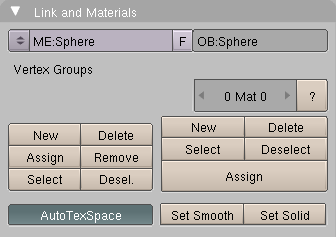
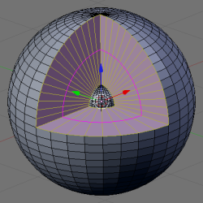

## 3.地核图层（Geothermal Layers）  ##

这个教程展示了网格编辑技术：

- 快速的顶点、线或面的选择 
- 循环切割 
- 顶点群组 
- 区域拉伸 
- 周长选择

### 设置 ###

1. 按CTRL-X，然后Enter来创建一个新的模型
2. 按Del，然后Enter移除立方体
3. 按下NUM7改变视角
4. 按下SPACE，然后Add->Mesh->UVSphere
5. 按下CTRL-Tab，然后2

### 选择和测量顶点 ###

1. 按下a来取消选择所有顶点
2. 按下b来进行选择
3. 按下RMB，然后选择1/4的球体

	

4. 按下NUM1看到半选的球体
5. 按下CTRL-Tab，然后1切换到顶点选择模式
6. 按下b来进行选择
7. 按下MMB，取消选择底部1/8的球体

	

8. 按F9来切换到编辑按钮
9. 点击New来创建一个新的Vertex Group

	

10. 给这个vertex group命名（例如：Cut-away）

	

11. 点击Assign来使用名字关联顶点的选择（1/8的球体）
12. 按下.或选择Pivot Menu来改变Pivot到3D Cursor：
	
	

13. 按下e，然后1，之后Enter来拉伸这个区域（但是不要移动它）
14. 按下s，然后0.193，之后Enter来缩放这个区域

	

15. 按下CTRL-Tab，然后3切换到面选择模式

### 切割和缩放 ###

1. 旋转视角
2. 点击Image Selection to Visible按钮： 
3. 点击SHIFT-RMB来选择三个面

	
 
4. 按下SHIFT-G，然后4来选择希望的面
5. 按下CTRL-+来增加面的选择
6. 放大核心，然后取消选择Cut-away面

	- 按下b，然后再按b
	- 点击MMB
	- 仔细的沿着边的红线拖拽

	
 
7. 按下SPACE
8. 点击Select>Inverse
9. 按下Set Smooth来光滑所有的东西除了里面的面
10. 按下SPACE
11. 点击Select>Inverse
12. 按下CTRL-Tab，然后2切换到边选择模式
13. 创建一个新的Vertex Group称为Faces（不要忘记点击Assign）
14. 按下CTRL-r来创建一个Loop Cut
 
	

15. 按下Enter来接受
16. 移动鼠标（不要点击）直到Percentage等于1.
17. 点击LMB
18. 按下s，然后.574，然后Enter来缩放Loop Cut
19. 按下CTRL-r来创建一个Loop Cut
20. 按下Enter来接受
21. 移动鼠标（不要点击）直到Percentage等于1.
22. 点击LMB
23. 按下s，然后.574，然后Enter来缩放Loop Cut
24. 重复之前的五步，但是使用.994作为缩放参数
25. 按下a来取消选着面

### 关联材质 ###

你可以使用Vertex Group来分配材质给不同的层。