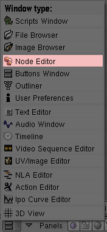
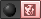

## 5.模糊对象-矢量模糊（Blurry Objects - Vector Blur） ## 

在Blender中有两种方式来完成模糊：Vector Blur和Motion Blur

- Motion Blur 更加精确，因为每一个场景被渲染16次（根据不同的采样值），然后合成最后的一个图片。 
- Vector Blur 更加快速，因为只有运动中的对象在场景中被渲染。然而，它需要更多设置。

### Vector Blur根据以下步骤设置静态图片： ###

1. 设置。渲染一个场景中的一帧（或图片）。
2. 运动中的对象。

	- 移动要模糊的对象
	- 重复之前的步骤直到需要模糊的运动范围被覆盖了。

3. Blender模糊。计算对象在第一和最后一个场景中的模糊。
4. 渲染帧。合并每一个帧到最后的图片。

**设置**

1. 按下CTRL-x，然后Enter创建一个新的场景
2. 按下Del，然后Enter来删除3D立方体
3. 按下SPACE
4. Add>Mesh>UVspere
5. 点击OK，然后再次点击OK
6. 按下Tab切换到对象模式
7. 按下SPACE
8. Add>Curve>Bezier Circle
9. 按下Tab切换到对象模式

**运动下的对象**

1. 按下z来切换到线框模式
2. 按下RMB来选择UVsphere
3. 按下g，然后x，最后是2，然后Enter来移动UVsphere远离Bezier Curve
4. 点击SHIFT-RMB来重新选择Bezier Curve
5. 按下CTRL-p
6. 点击Follow Path使Bezier Circle为UVsphere的父路径
7. 点击SR:2-Model，然后改变它为1-Animation。

	

8. 按下F10到场景按钮
9. 点击Render Layers选项
10. 点击Vec

	

11. 点击Anim选项卡中的Do Composite
12. 点击RMB来只选择Bezier Circle

	

13. 按下F9
14. 改变PathLen:从100到10

**Blender模糊**

1. 改变Window Type从Buttons Window到Node Editor

	

2. 点击Composite Nodes图标： 
3. 点击Use Nodes
4. Add>Filter>Vector Blur
5. 滚动Node Editor窗口，那么所有的项目都是可见的

	

6. 将Vector Blur面板放在Render Layer和Composite之间

	

7. 连接Image到Image，Z到Z，以及Speed到Speed。
8. 连接Image到Image（从Vector Blur到Composite）

	

9. 点击play图标，看完UVsphere振动后按ESC

**渲染**

按F12来渲染

在动画时Vector Blur是Motion Blur的一个很好的替代品。这是因为任何单一的包括模糊的动画帧会显示为几分之一秒。
