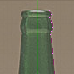
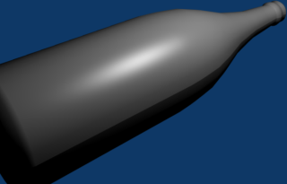
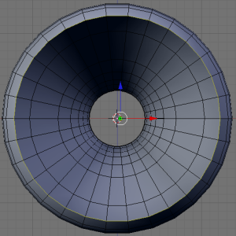

## 7.图片临摹（Image Tracing） ##

这个教程展示了如何根据一个图片来创建一个3D网格

### 设置 ###

1. 按下CTRL-x，然后Enter来删去当前场景
2. 按下Del，然后Enter来删除立方体

### 描绘对象 ###

1. 找到一个图片来临摹

	

2. View>Backgroud Image
3. 点击Use Backgroud Image
4. 点击Load
5. 找到要临摹的图片，然后加载
6. 调整Size，直到整个瓶子都是可见的（例如Size:3.50）

### 临摹 ###

1. 点击Poly来转变Bezier Curve为一组顶点
2. 按下r，然后z，之后是90，按下Enter来旋转顶点
3. 按下g，然后x，编辑顶点的位置
4. 移动鼠标直到顶点和瓶子的边缘对齐。

	按下CTRL和SHIFT单独或一起来更多的控制顶点的位置
	
	

5. 按下w，然后是Enter通过细分来创建更多顶点
6. 再做一次
7. 按下a来取消选定所有的顶点
8. 按下RMB来选择一个单独的顶点
9. 按下g来移动这个顶点到位置
10. 继续，知道顶点和瓶子的边缘对齐

	对于复杂的部分（例如瓶嘴和瓶勃）要比简单的部分使用更多的顶点
 	
 	

11. 删除没有给瓶子的形状添加细节的顶点

### 创建模型 ###

1. 在Backgroud Image面板上点击Use来隐藏瓶子
2. 按下Tab转为对象模式
3. 按下NUM1转到侧视图
4. 按下CTRL-w来保存你的图片；下一步不能颠倒
5. 按下ALT-c，然后Enter来从曲线创建一个网格
6. 按下Tab转为编辑模式
7. 按下a来选择所有的顶点
8. 改变Degr：为360.00
9. 改变Steps：为30

	
 
10. 点击Spin
11. 按下NUM7来看这个瓶子
12. 点击Set Smooth
13. 按下F12来渲染，之后按ESC退出

	

### 完成网格 ###

这个瓶子没有厚度。这个瓶子也没有底。这个瓶子还没有完全完成。

### 瓶底 ###

1. 按下NUM1
2. 按下Tab
3. 按下a来取消选择所有的顶点
4. 点击Limit Selection to Visible图标： 
5. 按下CTRK-Tab，然后2切换到边选择模式
6. 在底部边缘点击SHIFT-RMB
7. 按下SHIFT-G，然后1来选择类似长度的边

	

8. 按下SHIFT-F通过连接选择的所有边来创建一个面（瓶子的底部）

### 瓶子的厚度 ###

1. 按下NUM1
2. 按下NUM6 12次，看着瓶子
3. 按下CTRL-Tab，然后1切换到顶点选择模式
4. 按下a来选择所有的顶点
5. 点击Rem Doubles来移动复制
6. 按下.来改变Pivot为3D Cursor
7. 按下NUM7
8. 点击Limit Selection to Visible来关闭它（那么给瓶子内部的厚度在添加时就会出现）
9. 按下e，然后Enter，再次Enter来拉伸（不要移动）这个内部的瓶子
10. 按下s，然后x，之后是.9，最后Enter
11. 按下s，然后z，之后是.9，最后Enter
12. 按下b
13. 点击，然后按住RMB，之后拖拽它越过所有的顶点除了沿着底部的顶点

	

14.按下g，然后y，之后.1，最后Enter来移动瓶子的内部有一个凹口。

### 材质 ###

1. 按下F5
2. 点击Add New
3. 改变Col为：R 0.333, G 0.733, B 0.267
4. 改变Spe为：R 0.467, G 0.667, B 0.400
5. 改变Alpha为：A 0.350
6. 点击Shaders选项；值如下：

	Ref: 1.000

	Spec: 2.000
	
	Hard: 511
	
	Tralu: 1.00
	
	Amb: 0.500

7. 按下Mirror Transp选项；值如下：

	Click Ray Mirror.

	RayMir: 0.20
	
	Depth: 5
	
	Fresnel: 1.00

	Fac: 1.25
	
	Click Ray Transp.
	
	IOR: 1.37
	
	Depth: 5

### 场景： ###

添加一个平面，改变它的纹理。旋转，缩放，然后给瓶子一个纹理。为了有趣添加一个红色的立方体。开启Ambient Occlusion（F5，然后World buttons图标）。渲染。

