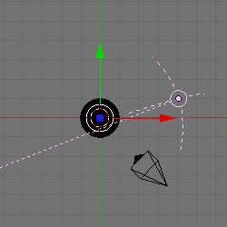
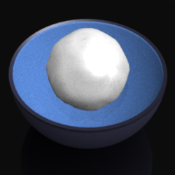

    <a href="./11.html">&laquo; 上一章</a> |
    <a href="./index.html">首页</a>
    | <a href="./13.html">下一章 &raquo;</a>

## 12.动画：碗中的流体（Liquid in Bowl） ##

这个教程描述了如何创建流体动画

### 概览 ###

这个教程里的流体动画包括：

- 流体。一个对象看起来像流体 
- 障碍。一个对象可以和流体作用，用来直接或阻止流动。 
- 领域。领域约束了流体允许流动的区域

### 设置 ###

这个教程用了之前的文件：

1. 阅读“碗”的教程
2. 找到之前完成的文件
3. 打开Blender，然后加载文件

### 调整视角 ###

1. 在摄像头上点击RMB
2. 按下F9
3. 改变Lens为75来缩放碗
4. 按下g，然后z，之后.5，将碗放在摄像机视角的中央
5. 按下NUM7
6. 按下z来显示网格
7. 按下NUM- 直到光源对象出现
8. 在光源上点击RMB
9. 按下F9
10. 点击Hemi

	

### 插入代表流体的球体 ###

1. 按下NUM1
2. 按下NUM+ 缩放碗
3. 在碗上按RMB来选择它
4. 按下F9
5. 点击Centre New
6. 按下SHIFT-S
7. 点击Cursor->Selection
8. 按下SPACE
9. 点击Add>Mesh>IcoSphere
10. 点击OK
11. 按下s，然后.5改变IcoSphere的比例
12. 按下s，然后z，之后.5移动IcoSphere
13. 按F7两次看到Physics按钮
14. 点击Enable来对IcoSphere开启fluid mechanica
15. 点击Fluid来使IcoSphere看起来像流体
16. 按下Tab切换到对象模式

### 对碗提供障碍物属性 ###

1. 在碗上点击RMB来选择它
2. 点击Enable对碗开启fluid mechanics
3. 点击Obstacle使碗能和流体相互作用
4. 点击Init Shell
5. 按下Tab切换到编辑模式
6. 按下CTRL-n，然后Enter来重新计算外围的法线
7. 按下Tab切换到对象模式

### 添加立方体域 ###

1. 按下NUM7切换到顶视图
2. 按下a来取消选定碗
3. 按下SPACE
4. 点击Add>Mesh>Cube
5. 按下s，然后x，之后2改变立方体沿着x轴的比例
6. 按下s，然后y，之后2改变立方体沿着y轴的比例
7. 按下NUM1切换到侧视图
8. 按下g，然后z，之后.5来使立方体向z轴上方移动

	

9. 点击Enable对立方体开启fluid mechanics
10. 点击Domain来限定流体在立方体上的动作区域

### 流体设置 ###

1. 提供一个目录给Blender-generated流体文件
2. 创建一个bowl目录和.blend文件在同一处
3. 按下F10
4. 改变End从250到50

### 生成网格序列 ###

1. 按下Tab
2. 按下F9
3. 点击Set Smooth
4. 按下F7
5. 点击BAKE，然后等一会儿
6. 按下ALT-a来观察网格下落
7. 完成后按下ESC
8. 按下F12，然后ESC

	

### 隐藏流体对象 ###

1. 在流体对象（Sphere.001）上按下RMB来选择它
2. 按下m，然后2，之后Enter来移动流体对象到Layer 2

### 预览动画 ###

如果对流体下落的动作还满意，可以预览下动画。

1. 按下F10
2. 点击25%
3. 改变Format从Jpeg到PNG
4. 点击Render>Render Animation
5. 等一会

### 编码动画 ###

下面是我用Ubuntu从一组图片中生成一个视频文件：

1. 找到已渲染的文件目录（通常为/tmp；查看Output标签）
2. 改变目录为cd /tmp
3. 使用Mencoder编码，每秒25帧：

	mencoder mf://*.png -mf type=png:fps=25 -ovc lavc -o bowl.avi

4. 使用Mplayer播放
	
	mplayer bowl.avi

### 结束 ###

还有些问题，尽管不会引起注意。这个流体：

- 落到碗里，并且 
- 在地面下稍微下沉

用下面的方法解决：

1. 按下F7
2. 在碗上点击RMB
3. 点击Part
4. 改变PartSlip Amount为0.25
5. 按下NUM1
6. 在平面对象上点击RMB
7. 点击Enable
8. 点击Obstacle
9. 点击Init Shell
10. 按下Tab，然后e，之后z，最后-0.1来拉伸平面，给它一个厚度
11. 按下Tab返回对象模式

	

### 生成最后的动画 ###

如果预览看起来还不错，增加分辨率和图片尺寸：

1. 按下F10
2. 点击50%
3. 改变End为150
4. 按下F7
5. 改变Preview-Res.为50
6. 改变Resolution为100
7. 删除animfluidsurface_preview_*.bobj.gz文件
8. 删除.png文件
9. 按下F10
10. 点击BAKE，然后等待
11. 点击Render>Render Animation
12. 放松一下

渲染完成后，按之前的方式来编码.png文件
